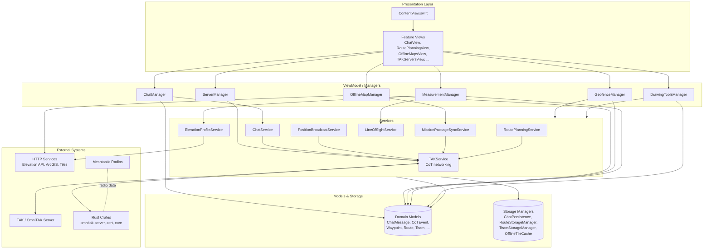
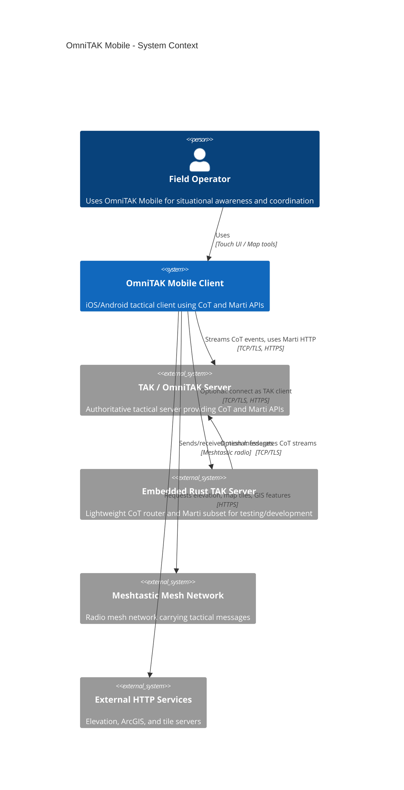
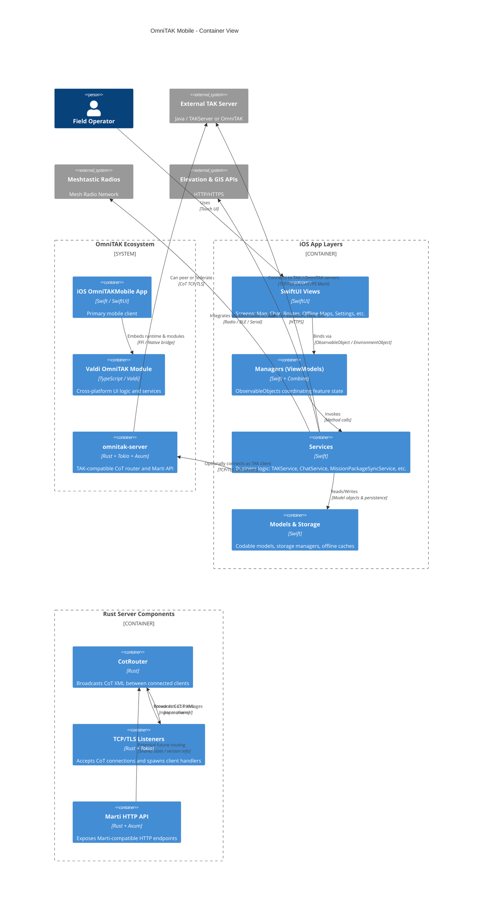

# OmniTAK Mobile

## Project Overview

OmniTAK Mobile is a tactical awareness and collaboration client designed to interoperate with TAK/OmniTAK ecosystems. The repository is a mono‑repo that combines:

- A feature‑rich iOS client built with SwiftUI and Map‑centric tooling
- Cross‑platform UI built on the Valdi TypeScript runtime (Android and future shells)
- A lightweight Rust TAK server/router for development, testing, and small deployments

The system focuses on real‑time geospatial collaboration using Cursor‑on‑Target (CoT) messages, mission packages, chat, and map tools.

### Purpose and Main Functionality

- Provide a mobile TAK/OmniTAK client with advanced map tools and collaboration features
- Connect to TAK‑compatible servers over CoT TCP/TLS and Marti HTTP APIs
- Offer an embedded TAK router/server for development, testing, or small‑scale deployments
- Integrate radio‑based Meshtastic networks alongside IP‑based TAK connectivity

### Key Features and Capabilities

- **Real‑time situational awareness**
  - CoT event streaming to/from TAK servers
  - Enhanced map overlays for tracks, trails, and markers
  - Team presence and unit status visualizations
- **Map and spatial tools**
  - Waypoints, point markers, geofences
  - Routes, measurement tools, line‑of‑sight and elevation profiles
  - Offline map packages and tile caching
- **Communication and collaboration**
  - Geo‑referenced chat and group conversations
  - Mission/data package import/export and sync
  - Basic video stream listing and playback hooks
- **Connectivity and integration**
  - Multi‑server federation and quick server switching
  - TLS certificate management and enrollment
  - Meshtastic radio integration for off‑grid networking
- **Extensibility**
  - Plugin system for extending the iOS client
  - Valdi‑based modules for cross‑platform UI components

### Likely Intended Use Cases

- Field teams needing tactical situational awareness on iOS and Android devices
- Developers building or testing TAK‑compatible integrations
- Labs and training environments requiring a lightweight TAK server and client
- Integrations with Meshtastic or other low‑bandwidth mesh networks

---

## Table of Contents

- [Project Overview](#project-overview)
- [Architecture](#architecture)
- [C4 Model Architecture](#c4-model-architecture)
- [Repository Structure](#repository-structure)
- [Dependencies and Integration](#dependencies-and-integration)
- [API Documentation](#api-documentation)
- [Development Notes](#development-notes)
- [Known Issues and Limitations](#known-issues-and-limitations)
- [Additional Documentation](#additional-documentation)

---

## Architecture

### High‑Level Architecture Overview

OmniTAK Mobile is organized into three main strata:

1. **iOS OmniTAK Mobile client** (`apps/omnitak/OmniTAKMobile`)
   - SwiftUI MVVM app with feature‑oriented folders (Views, Managers, Services, Models, Map, CoT, Meshtastic, Storage, Utilities, UI).
   - Uses managers as ViewModels, services for business logic and integrations, and models as shared DTOs.

2. **Valdi‑based cross‑platform UI** (`modules/omnitak_mobile`, `valdi`, `valdi_core`)
   - TypeScript/React‑style runtime powering OmniTAK UI components on Android and other shells.
   - Valdi `App` and `AppController` compose screens and route events to shared services.

3. **Rust TAK server and support crates** (`crates/omnitak-server`, other `crates/omnitak-*`)
   - `omnitak-server` provides CoT TCP/TLS routing and a Marti‑compatible HTTP API.
   - Additional crates provide certificate enrollment, CoT parsing, and FFI for mobile clients.

At runtime, a typical deployment has multiple OmniTAK Mobile clients connecting to one or more TAK servers (OmniTAK, TAKServer, or the included Rust server) using CoT and Marti APIs.

### Technology Stack and Frameworks

- **iOS client**
  - Language: Swift
  - UI: SwiftUI (with some UIKit map controllers/overlays)
  - Concurrency/Reactive: Combine (`ObservableObject`, `@Published`)
  - Mapping: MapLibre‑style controllers, custom overlays and markers
  - Storage: Codable models to disk, UserDefaults, platform storage helpers
  - Integration: Rust FFI via xcframework, Meshtastic protobuf parsing

- **Valdi cross‑platform modules**
  - Language: TypeScript / React‑like JSX
  - Runtime: Valdi platform and valdi_core modules
  - Domains: screens, controllers, TAK service wrappers, Meshtastic integration

- **Server and core logic**
  - Language: Rust
  - Async runtime: Tokio
  - HTTP framework: Axum (for Marti HTTP routes)
  - TLS: `tokio_rustls`
  - Data structures: `DashMap`, `tokio::mpsc` for CoT router

### Component Relationships

The iOS client follows a strict layering:

- **Views** (SwiftUI) bind to
- **Managers** (ViewModels, `ObservableObject`s) which orchestrate
- **Services** (business logic, networking, integrations) that operate on
- **Models** (domain data) and use
- **Storage / Utilities / FFI** for persistence and external calls.

Below is a simplified architectural diagram of the core runtime.



#### Key Design Patterns

- **MVVM with managers as ViewModels**
  - Clear separation between SwiftUI views and business logic
  - `ObservableObject` managers own state and delegate I/O to services

- **Service‑oriented domain layer**
  - Services encapsulate tactical workflows (chat, CoT, mission packages, measurements, navigation)
  - Each service has well‑defined inputs (models) and outputs (events, storage updates, CoT messages)

- **CoT‑centric messaging**
  - All key tactical actions (chat, position, markers, geofences, reports) are transformed to CoT XML events
  - A central `TAKService` handles socket connections and multiplexes CoT streams to domain services

- **Router‑based server backend**
  - The Rust server uses a `CotRouter` to decouple client handlers from broadcast logic via async channels

- **Subsystem‑oriented modularity**
  - Features grouped by domain (`Meshtastic/`, `Map/`, `CoT/`, `Storage/`, `Utilities/`) for discoverability and isolation

---

## C4 Model Architecture

> Note: These diagrams are inferred from the codebase structure and may not represent all deployment variations. They are intended as a starting point for understanding high‑level architecture.

### Context Diagram (C4 Level 1)

<details>
<summary>View Context Diagram</summary>



</details>

### Container Diagram (C4 Level 2)

<details>
<summary>View Container Diagram</summary>



</details>

---

## Repository Structure

> This section highlights only the most relevant areas for OmniTAK Mobile and the bundled server.

```text
apps/
  omnitak/
    OmniTAKMobile/
      Core/          # App entry, dependency wiring, global environment objects
      Views/         # SwiftUI screens (Map, Chat, Routes, Offline maps, Settings, etc.)
      Managers/      # ObservableObject ViewModels (ChatManager, ServerManager, ...)
      Services/      # Business logic & integrations (TAKService, ChatService, ...)
      Models/        # Domain models (CoTEvent, ChatMessage, Waypoint, Route, ...)
      Map/           # Map controllers, overlays, markers, tile sources
      CoT/           # CoT XML generators, parsers, filters, event handlers
      Meshtastic/    # Meshtastic models, protobuf parsers, integration hooks
      Storage/       # Persistence helpers and storage managers
      Utilities/     # Geospatial utils, network helpers, converters
      UI/            # Shared components, radial menu, MIL‑STD‑2525 symbology

  omnitak_android/  # Android Valdi host app
  omnitak_mobile_ios/ # iOS Valdi host app

modules/
  omnitak_mobile/   # Valdi OmniTAK module (TS/React-like app, controllers, services)
  omnitak_plugin_system/ # Plugin framework for extending OmniTAK iOS
  plugin-template/  # Scaffold for new plugins

crates/
  omnitak-server/   # Rust TAK server with CoT router and Marti subset
  omnitak-*         # Additional Rust crates (core, cert, FFI) used by mobile and server
```

Areas where additional structure documentation would be useful:

- A dedicated diagram for the map subsystem (controllers, overlays, tile sources)
- A catalog of plugins and how they are wired into the iOS app
- An overview of Rust crates and how each is consumed by the mobile clients

---

## Dependencies and Integration

### Internal Service and Manager Dependencies

- **TAKService (Swift)**
  - Central CoT networking service used by:
    - `ChatService` (GeoChat messages)
    - `PositionBroadcastService` (PLI updates)
    - `MissionPackageSyncService` (mission/data package exchange)
    - Various tactical services (e.g., geofencing, markers, emergency beacons)
  - Receives parsed CoT events and dispatches them to:
    - `ChatManager`, `TeamService`, `TrackRecordingService`, etc.

- **ServerManager (Swift)**
  - Manages configured TAK servers and current connection
  - Coordinates with `TAKService` for connect/disconnect
  - Uses `CertificateManager` and `CertificateEnrollmentService` for TLS

- **OfflineMapManager (Swift)**
  - Depends on `TileDownloader`, `OfflineTileCache`, and ArcGIS services

- **MeshtasticManager (Swift)**
  - Coordinates Meshtastic protobuf parsing and device selection
  - Integrates with Valdi/TypeScript Meshtastic services where applicable

### External Services and Message Flows

> External libraries are intentionally not listed, per request. This focuses on logical services and protocols.

- **TAK / OmniTAK Servers**
  - CoT stream over TCP or TLS
  - Optional Marti HTTP endpoints for metadata and configuration
  - OmniTAK Mobile can connect to the included `omnitak-server` or existing TAK deployments

- **Embedded Rust TAK Server (`omnitak-server`)**
  - Listens on configurable TCP/TLS ports (defaults visible in the crate)
  - Routes CoT XML between clients using `CotRouter`
  - Exposes a Marti‑compatible API (version, endpoints, TLS config) when fully wired

- **External HTTP APIs**
  - Elevation/profile APIs consumed by `ElevationAPIClient` and `ElevationProfileService`
  - GIS sources (e.g., ArcGIS feature and portal services)
  - Tile servers for online map base layers

- **Meshtastic Mesh Network**
  - Meshtastic devices send/receive protobuf messages
  - Converted into internal models and, when needed, into CoT events for TAK servers

- **Event Flows and Streams**
  - CoT events: OmniTAK Mobile ↔ TAK Server ↔ Other TAK clients
  - Mesh messages: Meshtastic ↔ OmniTAK Mobile ↔ (optionally) CoT stream
  - Mission packages: files/attachments ↔ `MissionPackageSyncService` ↔ TAK server or peers

Areas where more integration docs would help:

- Example network topologies (single server, federated, mesh‑bridge scenarios)
- Detailed explanation of Meshtastic ↔ CoT bridging behavior and limits

---

## API Documentation

This section summarizes the primary externally visible APIs provided or consumed by this repository in an implementation‑agnostic way.

### CoT Stream API (TCP/TLS)

**Provider:** TAK/OmniTAK servers and the Rust `omnitak-server` crate  
**Consumer:** OmniTAK Mobile clients (iOS, Android/Valdi)

#### Connection

- Protocol: TCP or TLS
- Data format: CoT XML messages sent as a stream
- Behavior (as implemented by `CotRouter` in `omnitak-server`):
  - Each client connection is identified by a `ClientId`
  - Messages from one client are broadcast to all **other** clients
  - The originating client does not receive its own CoT message back

#### Message Semantics

- CoT XML `<event>` elements represent:
  - Position/location updates (PLI)
  - Chat messages and attachments (GeoChat)
  - Tactical reports (e.g., CAS, MEDEVAC, SPOTREP, SALUTE)
  - Map entities (markers, routes, geofences, drawings)

The exact CoT types and XML schemas align with TAK/CoT conventions and are constructed by the mobile app’s CoT generators.

### Marti HTTP API (Rust Server)

**Provider:** `crates/omnitak-server` (Marti subset)  
**Consumer:** TAK‑style clients including OmniTAK Mobile

#### Base URL

- Typically `https://<host>:<marti_port>` (default port is defined in the Rust crate configuration)
- All paths are prefixed with `/Marti/api/`

#### Implemented Endpoints

The Marti HTTP router currently includes at least the following endpoints:

| Method | Path                          | Description                                                    |
|--------|-------------------------------|----------------------------------------------------------------|
| GET    | `/Marti/api/version`          | Returns server version and identity metadata                   |
| GET    | `/Marti/api/clientEndPoints`  | Returns available client endpoints (structure inferred)        |
| GET    | `/Marti/api/tls/config`       | Returns TLS configuration (structure inferred)                 |

##### `GET /Marti/api/version`

- **Request**
  - No required query parameters or body
  - Standard HTTPS client request
- **Response**
  - Content‑Type: `application/json`
  - Example shape:

    ```json
    {
      "version": "0.1.0",
      "type": "OmniTAK-Server",
      "api": "2",
      "hostname": "omnitak-server"
    }
    ```

- **Usage**
  - Health checks and server capability discovery

> Note: `clientEndPoints` and `tls/config` responses follow Marti/TAK conventions, but their detailed schemas should be verified from the Rust code or server runtime when available.

### Mobile Client HTTP APIs (Consumers)

OmniTAK Mobile does **not** expose a network HTTP API; it acts solely as a client. The following HTTP interactions are typical:

- **Elevation APIs**
  - Used by `ElevationAPIClient` and `ElevationProfileService`
  - Requests elevation samples or profiles for a given route or line
  - Responses mapped into `ElevationProfile` and `ElevationSample` models

- **GIS / ArcGIS APIs**
  - Used by `ArcGISFeatureService` and `ArcGISPortalService`
  - Fetches layers, features, and metadata for map overlays

- **Tile Services**
  - Used by `TileDownloader` and `OfflineTileCache`
  - Download raster or vector tiles for online and offline maps

Where possible, consult your specific deployment’s service documentation for concrete request/response formats.

Areas for future improvement:

- A consolidated Marti endpoint reference derived from actual responses
- Example CoT XML snippets for common workflows (chat, marker creation, mission package sync)

---

## Development Notes

### Project‑Specific Conventions

- **MVVM pattern on iOS**
  - All feature logic should live in managers (ViewModels) and services, not directly in views.
  - New features should:
    - Introduce or extend models in `Models/`
    - Add or extend services in `Services/`
    - Wire managers in `Managers/` and expose them to SwiftUI views via `@EnvironmentObject` or dependency injection.

- **Domain‑oriented folder layout**
  - Keep CoT‑related code under `CoT/` (generators, parsers, filters)
  - Map tools and overlays belong under `Map/`
  - Persistence helpers in `Storage/`
  - Meshtastic‑specific logic in `Meshtastic/`

- **Model design**
  - Prefer value‑type `struct` models
  - Conform to `Codable` and `Identifiable` when applicable
  - Use `Equatable` to simplify diffing and testing

- **CoT Integration**
  - All external‑facing tactical actions should map to a CoT event
  - Use existing CoT generators as templates for new event types

### Testing Requirements (Inferred)

Explicit testing infrastructure is not deeply documented in the analyzed files, but you can reasonably assume:

- **Unit tests for managers and services**
  - Managers are natural units for testing feature behavior without UI
  - Services performing CoT serialization, elevation queries, or route calculations should have unit tests where practical

- **Integration tests for the Rust server**
  - CoT routing behavior (`CotRouter`) should be validated with multiple client connections
  - Marti endpoints should be exercised with HTTP clients once wired into the server

Additional documentation that would be helpful:

- A dedicated TESTING.md describing how to run tests across Swift, TypeScript, and Rust
- Example test harnesses for the Rust server and CoT flows

### Performance Considerations

From the architecture and responsibilities, the main performance considerations are:

- **CoT traffic volume**
  - `CotRouter` uses async channels and a concurrent map; large numbers of clients or high message rates could stress routing
  - The mobile app maintains stateful representations of many CoT entities (markers, tracks, chat), so map rendering and list updates should be profiled under load

- **Map and overlay rendering**
  - Complex overlays (tracks, trails, measurement lines, geofences) can be expensive to render
  - Use aggregation and throttling in managers/services to avoid excessive UI updates

- **Offline maps and tile downloads**
  - Tile downloading and caching should respect bandwidth and storage constraints
  - Background operations should be carefully scheduled to avoid blocking the main UI

- **Meshtastic and radio integration**
  - Radio links are bandwidth‑constrained; CoT generators and services should avoid overly verbose payloads

---

## Known Issues and Limitations

Based on the analyzed code and comments, the following limitations or areas of technical debt are visible:

- **Marti server integration is not fully wired**
  - `omnitak-server` includes a Marti router and handlers, but `TakServer::start` contains a TODO to start the Marti HTTP server when enabled.
  - Until fully integrated, only CoT TCP/TLS routing may be active.

- **Partial documentation across subsystems**
  - The map subsystem (controllers, overlays) is complex and not fully documented.
  - Plugin system behavior and lifecycle are not clearly described from code alone.

- **Testing coverage not obvious**
  - The analyzed files do not clearly show the breadth of testing, particularly for Swift and TypeScript layers.

- **Potential scalability limits for CoT routing**
  - `CotRouter` uses a straightforward broadcast model; very large deployments might require sharding or backpressure.

Areas where explicit TODOs/FIXMEs likely exist (but are not fully enumerated here):

- Expanding Marti API coverage beyond the current subset
- Additional CoT event types and tactical workflows
- Further optimization of map overlays and offline map handling

---

## Additional Documentation

The repository contains several additional documentation files that provide deeper dives into specific topics. New developers are encouraged to explore them alongside this README.

- **iOS API and Architecture Docs**
  - `apps/omnitak/docs/API/Models.md` – Detailed model definitions and field descriptions
  - `apps/omnitak/docs/API/Services.md` – Overview of services and their responsibilities
  - `apps/omnitak/docs/Architecture.md` – High‑level architectural notes and patterns

- **Plugin System**
  - `modules/omnitak_plugin_system` – Source for the plugin framework and example usage
  - `plugin-template` – Starting point for creating new plugins

- **Rust Server Documentation**
  - `crates/omnitak-server` – Inline Rust documentation and comments describing configuration and extension points

Further documentation that would be valuable:

- A dedicated "Getting Started" guide for running the Rust server and connecting the mobile apps
- End‑to‑end walkthroughs for common workflows (connecting to a server, sharing a route, sending mission packages)
- Security hardening and deployment best‑practices for production TAK deployments
