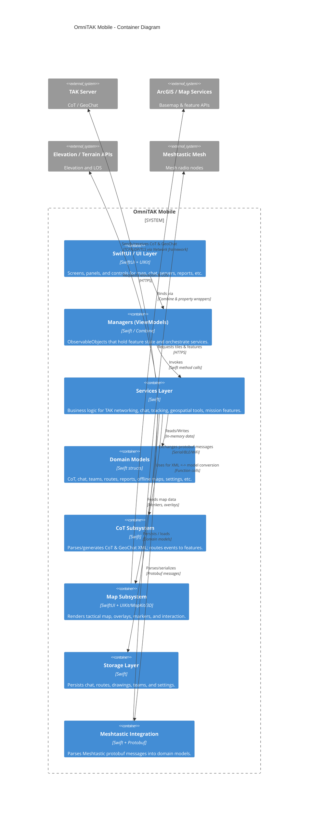

# OmniTAK Mobile

## Project Overview

OmniTAK Mobile is a SwiftUI-based iOS client for the TAK (Tactical Assault Kit) ecosystem. It connects to TAK servers over TCP/UDP/TLS, exchanges Cursor-on-Target (CoT) and GeoChat XML, and provides a tactical map, chat, and mission tools optimized for mobile operators.

The app is structured as a modular MVVM-style application with clear separation between Views, Managers (view models), Services, Models, Storage, Map, CoT, Meshtastic, and Utilities subsystems.

**Purpose and main functionality**

- Act as a mobile TAK client for situational awareness and collaboration.
- Maintain a live connection to one or more TAK servers, sending and receiving CoT/GeoChat traffic.
- Present tactical data (units, markers, routes, geofences, tracks, reports) on a map and via feature-specific views.
- Provide operator tools like measurements, drawings, offline maps, mission packages, and reports.

**Key features and capabilities**

- TAK network connectivity (TCP/UDP/TLS) with client certificates and legacy TLS support.
- Live map with CoT-based markers, tracks, grid overlays, range/bearing tools, elevation and line-of-sight analysis.
- GeoChat messaging with text, location, and image attachments.
- Position broadcasting (PLI), team and unit management, and tactical reports (SPOTREP, SALUTE, MEDEVAC, CAS, etc.).
- Offline maps and data packages, KML/KMZ import, mission package sync.
- Meshtastic integration for mesh radio data.

**Likely intended use cases**

- Field operators needing TAK interoperability from iOS devices.
- Training and exercises where a mobile TAK client is required.
- Tactical coordination, map-based planning, and real-time situational awareness.

## Table of Contents

- [Project Overview](#project-overview)
- [Architecture](#architecture)
- [C4 Model Architecture](#c4-model-architecture)
- [Repository Structure](#repository-structure)
- [Dependencies and Integration](#dependencies-and-integration)
- [API Documentation](#api-documentation)
- [Development Notes](#development-notes)
- [Known Issues and Limitations](#known-issues-and-limitations)
- [Additional Documentation](#additional-documentation)

## Architecture

### High-level architecture overview

OmniTAK Mobile follows a layered, MVVM-style architecture:

- **Views** (`Views/`, `UI/`)
  - SwiftUI screens and reusable UI components.
  - Bind to `ObservableObject` managers via `@StateObject`, `@ObservedObject`, or `@EnvironmentObject`.

- **Managers (ViewModels)** (`Managers/`)
  - Feature-centric view models (e.g., `ChatManager`, `ServerManager`, `OfflineMapManager`).
  - Hold UI-ready state and orchestrate calls to services and storage.

- **Services** (`Services/`)
  - Encapsulate business logic and integration with external systems.
  - Include `TAKService` (network core), `ChatService`, `PositionBroadcastService`, geospatial and tactical services.

- **Models** (`Models/`)
  - Domain data structures (CoT events, chats, routes, teams, reports, offline maps, etc.).
  - Mostly `struct`, `Codable`, `Identifiable`, `Equatable`.

- **CoT subsystem** (`CoT/`)
  - CoT XML parsing, generation, filtering, and event routing.
  - Bridges between CoT payloads and higher-level models/services.

- **Map subsystem** (`Map/`)
  - Map controllers (UIKit/MapKit/3D), overlays, markers, and tile sources.
  - Renders tactical data from models into visual layers and interactions.

- **Storage** (`Storage/`)
  - Persistence helpers for chat history, drawings, routes, teams, etc.

- **Utilities & Integrations** (`Utilities/`, `Meshtastic/`)
  - Calculators, converters (e.g., MGRS), KML/KMZ handling, elevation clients, Meshtastic protobuf parsing.

Data generally flows in one direction:

- Network/sensors/files → Services → Managers → Views.
- User input → Views → Managers → Services/Storage → Network.

### Technology stack and frameworks

- **Language:** Swift
- **UI:** SwiftUI with UIKit controllers for map/map-3D integration.
- **Reactive:** Combine (`@Published`, publishers/subscribers) and some async/await.
- **Networking:**
  - `Network` (`NWConnection`, `NWParameters`) for TAK (TCP/UDP/TLS).
  - `URLSession` for HTTP(S) integrations (ArcGIS, elevation, etc.).
- **Persistence:** `UserDefaults`, file-based storage; light-weight managers in `Storage/`.
- **Security:** `Security` framework for TLS, client certificates, and legacy cipher suites.

### Component relationships

#### Core interaction flow

```mermaid
flowchart LR
    subgraph UI[UI Layer]
        VChat[ChatView]
        VMap[Map Views]
        VServers[TAKServersView]
    end

    subgraph VM[Managers (ViewModels)]
        MChat[ChatManager]
        MMap[MapStateManager & Feature Managers]
        MServer[ServerManager]
    end

    subgraph S[Services]
        STAK[TAKService]
        SChat[ChatService]
        SPOS[PositionBroadcastService]
        SGeo[Geospatial & Tactical Services]
    end

    subgraph COT[CoT Subsystem]
        CParse[CoTMessageParser]
        CHandler[CoTEventHandler]
        CGen[CoT Generators]
    end

    subgraph MAP[Map Subsystem]
        MCtrl[Map Controllers]
        MOver[Overlays & Markers]
    end

    subgraph NET[Network]
        DNet[DirectTCPSender]
        TAKSrv[TAK Server]
    end

    VChat --> MChat
    VMap --> MMap
    VServers --> MServer

    MChat --> SChat
    MMap --> SGeo
    MServer --> STAK

    SChat --> STAK
    SPOS --> STAK
    SGeo --> STAK

    STAK --> DNet
    DNet <--> TAKSrv

    STAK --> CParse
    CParse --> CHandler
    CHandler --> MChat
    CHandler --> MMap

    MMap --> MCtrl
    MCtrl --> MOver
``

#### Request and data flow (high-level)

- **Outbound:** `SwiftUI View → Manager → Feature Service → TAKService → DirectTCPSender → NWConnection → TAK server`.
- **Inbound:** `TAK server → NWConnection → DirectTCPSender → CoTMessageParser → TAKService/CoTEventHandler → Managers → SwiftUI Views`.

### Key design patterns

- **MVVM:** Views are kept simple and rely on Managers for logic and state.
- **Layered architecture:** Clear separation between UI, view-model, service, model, and infrastructure layers.
- **Reactive state propagation:** Combine (`@Published`) used to push updates from services/managers to views.
- **Protocol-oriented design:** Traits and capabilities are expressed as Swift protocols (e.g., CoT generators), improving testability and reuse.
- **Singletons where appropriate:** Some core services (`ChatService.shared`, `PositionBroadcastService.shared`) are singletons used across the app.

## C4 Model Architecture

> Note: These diagrams are inferred from the code organization and may omit runtime details or dynamic dependencies.

### Context diagram

<details>
<summary>View C4 Context Diagram</summary>

```mermaid
C4Context
title OmniTAK Mobile - Context Diagram

Person(operator, "Field Operator", "Uses OmniTAK Mobile on iOS for situational awareness and communication.")

System(omniTAK, "OmniTAK Mobile", "iOS TAK client built with SwiftUI.")

System_Ext(takServer, "TAK Server", "Receives and distributes CoT and GeoChat traffic over TCP/UDP/TLS.")
System_Ext(arcgis, "ArcGIS / Map Services", "Provides basemaps, feature layers, and portal content via HTTPS.")
System_Ext(elevation, "Elevation / Terrain APIs", "Supplies elevation profiles, line-of-sight and terrain data.")
System_Ext(meshtastic, "Meshtastic Mesh", "Mesh radio devices exchanging protobuf messages.")
System_Ext(files, "KML/KMZ & Data Packages", "Imported/exported geospatial and mission package files.")

Rel(operator, omniTAK, "Uses", "Touch UI")
Rel(omniTAK, takServer, "Sends/receives CoT, GeoChat", "TCP/UDP/TLS")
Rel(omniTAK, arcgis, "Requests tiles & features", "HTTPS/REST")
Rel(omniTAK, elevation, "Requests elevation, LOS", "HTTPS/REST")
Rel(omniTAK, meshtastic, "Exchanges telemetry/messages", "Serial/BLE/WiFi (protobuf)")
Rel(omniTAK, files, "Imports/exports", "Filesystem / share sheet")
```

</details>

### Container diagram

<details>
<summary>View C4 Container Diagram</summary>



</details>

## Repository Structure

> This is a minimal overview of the most important directories. Names are inferred from code structure and may differ slightly from the actual tree.

```text
OmniTAKMobile/
  Core/           # App entry point and root composition
  Views/          # SwiftUI screens for map, chat, servers, reports, tools
  UI/             # Reusable UI components, radial menu, MIL-STD-2525 symbols
  Managers/       # Feature view-models (ChatManager, ServerManager, etc.)
  Services/       # Business logic and integrations (TAKService, ChatService, ...)
  Models/         # Domain models (CoT, chat, teams, routes, reports, etc.)
  CoT/            # CoT parsing, generation, filtering, dispatch
  Map/            # Map controllers, overlays, markers, tile sources
  Storage/        # Persistence helpers for chat, routes, drawings, teams
  Utilities/      # Calculators, converters, network helpers, KML/KMZ
  Meshtastic/     # Meshtastic protobuf models and parsers
  Resources/      # Assets, certificates, bundled docs
```

- **Core files:** `OmniTAKMobileApp.swift`, `ContentView.swift` bootstrap the application and inject shared services.
- **Key cross-cutting files:** `TAKService.swift` (network core), `CoTMessageParser.swift`, `CoTEventHandler.swift`, map controllers under `Map/Controllers`.

## Dependencies and Integration

### Internal service dependencies

- **Views → Managers:**
  - Each feature view holds a reference to its manager (e.g. `ChatView → ChatManager`, `OfflineMapsView → OfflineMapManager`).
- **Managers → Services:**
  - Managers orchestrate one or more services (e.g. `ChatManager → ChatService + ChatPersistence`).
- **Services → TAKService:**
  - Many services use `TAKService` for network transport (e.g. chat, position broadcast, geofences, mission packages).
- **CoT subsystem:**
  - `TAKService` wires incoming messages into `CoTMessageParser` and `CoTEventHandler`, which then distribute events to managers/services.

### External systems and protocols

> External libraries are intentionally omitted; this focuses on networked systems and protocols.

- **TAK server connectivity**
  - `DirectTCPSender` uses `NWConnection` for TCP/UDP/TLS connections.
  - `TAKService` manages connection lifecycle, send/receive buffers, and statistics.
  - TLS is configured via `Security` APIs and supports client certificates and optional legacy cipher suites.

- **ArcGIS / map services**
  - Tile and feature services are consumed over HTTPS via `URLSession`.
  - Used by map tile sources and feature layers in `Map/TileSources` and related services.

- **Elevation / terrain APIs**
  - Used by services like `ElevationProfileService` and `LineOfSightService` to support elevation profiles and LOS analysis.

- **Meshtastic mesh network**
  - Protobuf messages parsed in `Meshtastic/` and mapped to internal models.
  - Integrated as an additional data source for tactical information.

- **File-based integrations**
  - KML/KMZ parsing and import via utilities under `Utilities/`.
  - Data packages and mission packages handled by corresponding services and storage managers.

- **Event streams / message flows**
  - CoT/GeoChat traffic from TAK is effectively a continuous message stream that is:
    - Buffered and parsed by `CoTMessageParser`.
    - Routed by `CoTEventHandler` to managers.
  - Meshtastic messages form a separate, protobuf-based stream.

## API Documentation

> The app does not expose an HTTP/REST API. The "APIs" documented here are internal Swift service APIs and the TAK network endpoints they consume.

### TAK network endpoints

OmniTAK Mobile connects to configured TAK servers using host, port, and protocol information maintained by `ServerManager` and the `TAKServer` model.

- **Endpoint types:**
  - `tcp://<host>:<port>`
  - `udp://<host>:<port>`
  - `tls://<host>:<port>` (TLS over TCP, with optional client certificate)

- **Configuration fields (TAKServer model):**
  - `name: String` – human-readable label.
  - `host: String` – server hostname or IP.
  - `port: UInt16` – service port.
  - `protocolType: String` – typically `"tcp"`, `"udp"`, or `"tls"`.
  - `useTLS: Bool` – whether to use TLS.
  - `certificateName: String?` and `certificatePassword: String?` – optional client certificate.
  - `allowLegacyTLS: Bool` – enable older TLS versions/ciphers.

#### Connection lifecycle (TAKService)

- **Connect**

```swift
connect(
  host: String,
  port: UInt16,
  protocolType: String,
  useTLS: Bool,
  certificateName: String? = nil,
  certificatePassword: String? = nil,
  allowLegacyTLS: Bool = false,
  completion: @escaping (Bool) -> Void
)
```

Establishes a connection to a TAK server using the `Network` framework. When ready, the internal receive loop starts and inbound messages are delivered via callbacks.

- **Disconnect**

```swift
disconnect()
```

Closes the active connection and stops receiving messages.

- **Send CoT message**

```swift
send(cotMessage: String, priority: MessagePriority)
```

Takes a CoT XML string (generated by feature-specific CoT generators) and sends it to the server. Outbound messages ultimately flow through `DirectTCPSender`.

### Internal service APIs

#### ChatService

- **Role:** Implements GeoChat-style messaging over TAK.
- **State:**
  - `messages: [ChatMessage]`
  - `conversations: [Conversation]`
  - `participants: [ChatParticipant]`
  - `unreadCount: Int`, `queuedMessages: [QueuedMessage]`
- **Key operations:**
  - `configure(takService: TAKService, locationManager: LocationManager)`
  - `sendTextMessage(_ text: String, to conversationId: String)`
  - `sendLocationMessage(location: CLLocation, to conversationId: String)`
  - `processQueue()` – re-send queued messages when connectivity returns.

**Request/response format (conceptual):**

- **Outbound request:**
  - Input: `text`, target conversation, optional location/attachment.
  - Processing: Build `ChatMessage` model → convert to GeoChat/CoT XML → send via `TAKService`.

- **Inbound response:**
  - Input: GeoChat/CoT XML from TAK server.
  - Processing: Parse XML → map to `ChatMessage` and `Conversation` → update `ChatManager` state.

#### PositionBroadcastService

- **Role:** Regularly publishes own position to TAK (PLI events).
- **Configuration & state:**
  - `isEnabled: Bool`, `updateInterval: TimeInterval`, `staleTime: TimeInterval`.
  - Identity fields: `userCallsign`, `userUID`, `teamColor`, `teamRole`, `userUnitType`.
- **Key operations:**
  - `configure(takService: TAKService, locationManager: LocationManager)`
  - `startBroadcasting()` / `stopBroadcasting()`
  - `broadcastPositionNow()`

**Request/response format (conceptual):**

- **Outbound:** Periodic tasks create a PLI CoT XML event from current GPS fix and identity fields, then send via `TAKService`.
- **Inbound:** Other units' PLIs arrive as CoT, parsed into `CoTEvent` and rendered as markers/tracks on the map.

#### CoT parsing and distribution

- **Parsing:** `CoTMessageParser` takes raw XML strings and extracts:
  - CoT events → `CoTEvent` models.
  - Chat messages → `ChatMessage` and related models.
- **Distribution:** `CoTEventHandler` receives parsed models and routes them to:
  - Chat, map, tracks, geofences, team, and report managers/services.

## Development Notes

### Project-specific conventions

- **Directory-based modularization:** Features are grouped into coherent folders (`Chat`, `Map`, `Reports`, `Meshtastic`, etc.) under `Views/`, `Managers/`, `Services/`, and `Models/`.
- **MVVM naming:**
  - Views use `*View` suffix.
  - Managers use `*Manager` suffix and conform to `ObservableObject`.
  - Services use `*Service` suffix and encapsulate business logic.
- **Models:** Generally `struct`, `Codable`, and `Identifiable` to simplify storage and SwiftUI integration.
- **CoT utilities:** Generators and parsers are organized under `CoT/Generators` and `CoT/Parsers` by feature.

Areas where additional documentation would help:

- Clearer description of feature boundaries (e.g., which manager/service owns which responsibilities in edge cases).
- Explicit lifecycle notes for singletons and shared services.
- End-to-end examples for complex flows (e.g., mission packages, Meshtastic integration).

### Testing requirements

Inferred patterns suggest:

- **Unit tests** for:
  - CoT/GeoChat parsing and generation (XML ↔ models round-trips).
  - Service-level logic (e.g., message queueing and retry in `ChatService`, broadcast timing in `PositionBroadcastService`).
  - Utility calculators/converters (measurement, coordinate conversions).

- **Integration tests** for:
  - TAK connectivity scenarios (connect, disconnect, reconnect, legacy TLS).
  - Map integration paths (markers, overlays, offline tiles) with mocked data.

The repository would benefit from:

- Documented locations and naming of existing tests.
- Guidance on how to run tests and what environment variables/configuration are needed for networked tests.

### Performance considerations

From the design:

- **Network buffering:**
  - `DirectTCPSender` maintains a string buffer with locking for partial TCP reads; careful handling minimizes allocations and parsing overhead.
- **Reactive updates:**
  - Combine-based propagation limits manual KVO and keeps UI updates efficient, but heavy `@Published` lists (e.g., many markers) can be expensive.
- **Map rendering:**
  - Overlays and markers should be used judiciously; large numbers of CoT markers or tracks may impact performance.

Potential optimization areas (worth documenting or investigating):

- Strategies for throttling high-frequency CoT traffic.
- Marker clustering or decimation of tracks on the map.
- Background processing of heavy XML parsing or file imports.

## Known Issues and Limitations

Based on the architecture and code patterns, likely or explicit limitations include:

- **TLS security trade-offs:**
  - The TLS configuration in `DirectTCPSender` accepts self-signed certificates and may disable strict server verification. This is necessary for some TAK deployments but reduces security and should be documented and reviewed for production.

- **No public HTTP API:**
  - Integration is done via TAK servers and external services; you cannot call OmniTAK Mobile over HTTP as a service.

- **Reliance on external services:**
  - Functionality such as basemaps, elevation, and some mission tools depend on availability and configuration of ArcGIS and elevation services.

- **Feature surface area:**
  - The app includes many tactical tools (reports, mission packages, Meshtastic, offline maps). Some flows may be partially implemented or depend on external systems that are not fully documented here.

Where to capture TODOs and technical debt (recommended but not enforced by the code):

- Use inline `TODO:` / `FIXME:` comments in code for localized issues.
- Maintain feature-level markdown docs describing incomplete or experimental subsystems.

## Additional Documentation

Additional documentation exists within the repository and should be consulted for feature-specific details and API references. Common locations and types include:

- `Resources/Documentation/` – in-repo documentation for features and interfaces.
- `OmniTAKMobile/` subdirectories – many subsystems have local comments and inline docs.

Suggested additions that would help new developers:

- A dedicated **Architecture** document describing major subsystems and data flows.
- Per-feature guides for:
  - TAK server configuration and certificate enrollment.
  - Chat/GeoChat usage and offline behavior.
  - Map tools (measurement, drawing, reports, mission packages).
  - Meshtastic integration setup and troubleshooting.
